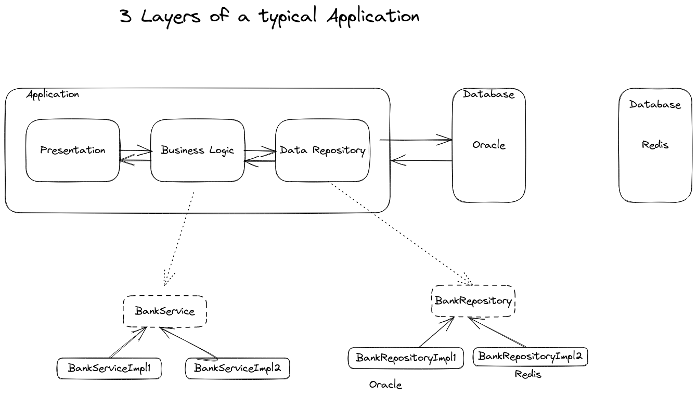

# Spring Boot Course

## Links

- [Pages Home](pages/Home.md)

## Day 01 Introduction

18 Apr 23, Tuesday

We'll be going through these slides and the corresponding demos for this course.

[Welcome](https://github.com/rumq/spring-boot-in-3-weeks/blob/master/slides/pdfs/00-Welcome.pptx.pdf)

1. [01_Introduction_to_Spring_Boot](https://github.com/rumq/spring-boot-in-3-weeks/blob/master/slides/pdfs/01_Introduction_to_Spring_Boot.pptx.pdf)
2. [02_Creating_Simple_App](https://github.com/rumq/spring-boot-in-3-weeks/blob/master/slides/pdfs/02_Creating_Simple_App.pptx.pdf)
3. [03_Creating_Web_App](https://github.com/rumq/spring-boot-in-3-weeks/blob/master/slides/pdfs/03_Creating_Web_App.pptx.pdf)
4. [04_Beans_Dependency](https://github.com/rumq/spring-boot-in-3-weeks/blob/master/slides/pdfs/04_Beans_DependencyInjection.pptx.pdf)
5. [05_Injection_Techniques](https://github.com/rumq/spring-boot-in-3-weeks/blob/master/slides/pdfs/05_Injection_Techniques.pptx.pdf)
6. [06_Configuration_Classes](https://github.com/rumq/spring-boot-in-3-weeks/blob/master/slides/pdfs/06_Configuration_Classes.pptx.pdf)
7. [07_Spring_Boot_Techniques](https://github.com/rumq/spring-boot-in-3-weeks/blob/master/slides/pdfs/07_Spring_Boot_Techniques.pptx.pdf)
8. [08_Integrating_Data_Sources](https://github.com/rumq/spring-boot-in-3-weeks/blob/master/slides/pdfs/08_Integrating_Data_Sources.pptx.pdf)
9. [09_Querying_Modifying_Entities](https://github.com/rumq/spring-boot-in-3-weeks/blob/master/slides/pdfs/09_Querying_Modifying_Entities.pptx.pdf)
10. [10_Spring_Data_Repositories](https://github.com/rumq/spring-boot-in-3-weeks/blob/master/slides/pdfs/10_Spring_Data_Repositories.pptx.pdf)
11. [11_Simple_Rest_Services](https://github.com/rumq/spring-boot-in-3-weeks/blob/master/slides/pdfs/11_Simple_Rest_Services.pptx.pdf)
12. [12_Full_Rest_Services](https://github.com/rumq/spring-boot-in-3-weeks/blob/master/slides/pdfs/12_Full_Rest_Services.pptx.pdf)
13. [13_Consuming_Rest_Services](https://github.com/rumq/spring-boot-in-3-weeks/blob/master/slides/pdfs/13_Consuming_Rest_Services.pptx.pdf)
14. [14_Messaging_Kafka](https://github.com/rumq/spring-boot-in-3-weeks/blob/master/slides/pdfs/14_Messaging_Kafka.pptx.pdf)
15. [15_Containerization](https://github.com/rumq/spring-boot-in-3-weeks/blob/master/slides/pdfs/15_Containerization.pptx.pdf)
16. [16_SpringCloudMicroservices](https://github.com/rumq/spring-boot-in-3-weeks/blob/master/slides/pdfs/16_SpringCloudMicroservices.pptx.pdf)
17. [17_Authentication_OAUTH2](https://github.com/rumq/spring-boot-in-3-weeks/blob/master/slides/pdfs/17_Authentication_OAUTH2.pptx.pdf)
18. [18_Testing](https://github.com/rumq/spring-boot-in-3-weeks/blob/master/slides/pdfs/18_Testing.pptx.pdf)

We've gone through the first 3 today, and looked at the 4rth Bean injection briefly. We'll start from there in the next class.

Today's meeting is recorded. You can find it here [Spring Boot Day 01 Introduction](https://drive.google.com/file/d/1Y66X-1sJSfrGhCemM0Ggh50nbCrNu8mj/view?usp=share_link).

## Day 02 Bean Dependency

20 Apr 23, Thursday

Today we've gone through [04_Beans_Dependency](https://github.com/rumq/spring-boot-in-3-weeks/blob/master/slides/pdfs/04_Beans_DependencyInjection.pptx.pdf).

#### Assignments

1. Go through the article [Dependency Injection Demystified](https://www.jamesshore.com/v2/blog/2006/dependency-injection-demystified)
2. Go through the article [Composition, Aggregation, and Association in Java](https://www.baeldung.com/java-composition-aggregation-association).
3. Pick a domain to build your Spring Boot app and start implementing what we are learning in the class. You'll show your app in the next class.
4. Go through the slides until 06_Configuration_Classes and run ALL the corresponding demos while you are going through the slides.
5. Write notes on the following in the corresponding markdown files
   1. What's the difference between a Framework and a Library? [Q001](Q001FrameworkVsLibary.md)
   2. What's a Bean? [Q002](Q002WhatsABean.md)
   3. What's a Component? [Q003](Q003WhatsAComponent.md)
   4. What's Singleton? [Q004](Q004WhatsASingleton.md)
   5. What's Singleton Scope and Prototype Scope? [Q005](Q005SingletonVsPrototypeScope.md)

Today's meeting is recorded. You can find it here [Spring Boot Day 02 Bean Dependency](https://drive.google.com/file/d/1EtrYeZHOkxTqGdNoDig-sBKhwwvMpy6z/view?usp=share_link).

## Day 03 Basics Chapters 1 to 4

25 Apr 23, Tuesday

We've started looking at this example [pawarv-demo-02-basics](https://github.com/rumq/spring-boot-in-3-weeks/tree/master/pawarv/pawarv-demo-02-basics).

We've seen that we need the following two dependencies in our `pom.xml` to enable 'live reload', i.e., the application restarts whenever we make any changes.
This helps us to see the changes we make in the code without having to restart the application manually.

```xml
<dependency>
   <groupId>org.springframework.boot</groupId>
   <artifactId>spring-boot-devtools</artifactId>
   <optional>true</optional>
</dependency>
<dependency>
   <groupId>org.springframework.boot</groupId>
   <artifactId>spring-boot-starter-web</artifactId>
</dependency>
```

Assignment:

1. Go through the assignments from Day 02. Write answers to the questions in the corresponding markdown files Q001 to Q005.
2. Try to understand the code in the example `pawarv-demo-02-basics` for the print statements until `08C`.
   Come with questions for the class.

Today's meeting is recorded. You can find it here [Spring Boot Day 03 Basics Chapter 1 to 4](https://drive.google.com/file/d/1zsJtVfgeVuPQa3KpOBwRBmbcbu15hLq8/view?usp=share_link).

## Day 04 Exercise on Hospital Domain

27 Apr 23, Thursday

In the class we've started exercising the concepts we've learned from chapters 1 to 4 on the Hospital domain.

We've done until 002 getting bean by type.

We'll continue continue from there in the next class.

Assignment:

1. Try exercising 001 through to 008C on your domains.
2. See the video mentioned in the following documents.
   1. [Object Equality](https://github.com/rumq/java-corejava-course/blob/main/pages/ObjectEquality.md)
   2. [String Intering](https://github.com/rumq/java-corejava-course/blob/main/pages/StringIntern.md)

Today's recording [Day 04 Exercise on Hospital Domain](https://drive.google.com/file/d/1SLYeBkIYACke3z9QpGpGcKS2AJEZDnVa/view?usp=share_link)

## Day 05 Scope Autowiring and Constructor Injection

02 May 23, Tuesday

In this class we exercised prototype component, dependency injections (@Autowired) and constructor injection.

We've done until 07 Constructor injection

We'll continue from there in the next class.

Assignment:

1. Make the toString() method on the domain class more presentable using `String.format` and `%s`
2. Try exercising 08 Qualifier, Collection, Map injection. Make the code ready on your personal domain for the next class.

Today's recording [Day 05 Scope Autowiring and Constructor Injection](https://drive.google.com/file/d/1Y3LHAWUr9cS98DieaRuur_yd_IB9we5A/view?usp=sharing)

## Day 06 Injection techniques

In this class we have done 08 exercising collection, map and other injection techniques.

We've partially done 09 Injecting values.

Assignment:

1. Try exercising 09 Injecting values.
2. Read the slides

Today's recording [Day 06 Injection Techniques](https://drive.google.com/file/d/1L6Mr5gjXsKK-etgta0m8FE2IbdQbysCa/view?usp=share_link)

## Day 07 ch04 Bean Dependency Injection

In this class we continued with 04_Beans_DependencyInjection.

We looked at some more examples of injecting values from [pawarv-demo-02-basics](https://github.com/rumq/spring-boot-in-3-weeks/tree/master/pawarv/pawarv-demo-02-basics).

Later we looked at `BankService` and `BankRepository` examples from [demo-04-beans-dependencyinjection](https://github.com/rumq/spring-boot-in-3-weeks/tree/master/demos/demo-04-beans-dependencyinjection)

You can look at the diagram from the class `3 Layers of a typical application ` below :



Assignments:

1. Do the assignment from 04_Beans_DependencyInjection slide.
2. Try recreating the BankService and BankRepository example in your chosen domain. Look at the example in this repository [pv-demo-04-beans-dependencyinjection](code/pv-demo-04-beans-dependencyinjection/README.md) for a better understanding..

Today's recording [Day 07 ch04 Bean Dependency Injection](https://drive.google.com/file/d/1TAr-eDEJNZmUlZW62VdvKZcj1ZMe7LCR/view?usp=share_link).

## Day 08 Recap

01 May 23, Thursday

We have done a recap of the topics we have covered so far.

You'll also see how to create the constructor and the toString() method using IntelliJ IDEA generate command `ctrl-N` or `command-N` for Mac.

We looked at the example [pawarv-demo-02-basics](https://github.com/rumq/spring-boot-in-3-weeks/tree/master/pawarv/pawarv-demo-02-basics) and recreated field and constructor injection in Restaurant domain.

Assignments:

If you have not done them already, go through the assignments from the previous classes and complete them.
Especially these ones :

1. Day 07 1 & 2
2. Day 06 1 & 2
3. Day 05 2
4. Day 04 2
5. Day 02 4

Today's recording [Day 08 Recap](https://drive.google.com/file/d/1gmf9lSF8JN_0QsUQil_EtWeGWS7PbJ3z/view?usp=share_link).

## Day 09 ch06 Configuration classes

15 May 23, Monday

We looked at the assignments done and then proceeded to look at [06_Configuration_Classes slide](https://github.com/rumq/spring-boot-in-3-weeks/blob/master/slides/pdfs/06_Configuration_Classes.pptx.pdf).

Assignment:

1. Read the contents of the slides in 06, and do the exercise in the slides.
2. Go through the examples from 06 chapter from both the repositories `spring-boot-in-3-weeks` and `java-springboot-course`, i.e., [demo-06-configurationclasses](https://github.com/rumq/spring-boot-in-3-weeks/tree/master/demos/demo-06-configuration-classes) and [pv-demo-06-configurationclasses](https://github.com/rumq/java-springboot-course/tree/main/code/pv-demo-06-configuration-classes).
3. Try to recreate the examples in your domain.
4. Go through [Assignment 1](https://github.com/rumq/spring-boot-in-3-weeks/blob/master/assignment-specs/Assignment1.docx) of the course. Let me know if you have any questions.You'll be doing it after the next class on 07_Spring_Boot_Techniques.

In the next next class we'll look at the assignments and start with 07_Spring_Boot_Techniques.

Today's recording [Day 09 ch06 Configuration classes](https://drive.google.com/file/d/1YmHccKE81jugVrsGAu2RN8DJuDcN5Ouq/view?usp=share_link)

## Day 10 ch06 Configuration classes continued

We went through the rest of the slides in 06_Configuration_Classes.

Assignment:

1. Do the Assignment 1 from the course.
2. Go through ch07 slides.

Today's recording [Day 10 ch06 Configuration classes continued ](https://drive.google.com/file/d/15lsOGxZSV0TF7MKOeNo8HRalzLa547vo/view?usp=share_link)

## Day 11 ch07 Spring Boot Techniques

We went through the slides in 07_Spring_Boot_Techniques.

Assignment:

1. Go through the slides in 07_Spring_Boot_Techniques. Come prepared to demo the example on profiles.
2. Continue with the Assignment 1 from the course.

Today's recording [Day 11 ch07 Spring Boot Techniques](https://drive.google.com/file/d/1QgiU5wK3IS9ho8lrVN2qo62x9Hxc1Ql3/view?usp=share_link).

## Day 12 ch07 Spring Boot Techniques continued

We went through some parts of the slides in 07_Spring_Boot_Techniques.
Also we looked in more detailed the example created by the author for a better understanding and to gain the confidence on some important concepts in this chapter.

Assignment:

1. Go through the example created by PawarV about this chapter and see if everything is clear
2. Replicate the same example for a better understanding
3. Go through the exercise of this chapter and also in the Assignment1

## Day 13 ch08 Integration Data Sources

On 5 June, Monday.

We went through the slides in 08_Integration_Data_Sources.

Assignment:
1. Go through the slides in 08_Integration_Data_Sources.
2. Read the samples in the slides using your own domain
3. Read slides in 09_Querying_Modifying_Entities.

Today's recording [Day 13 ch08 Integration Data Sources](https://drive.google.com/file/d/1UIHg0D8hMFl2BcgpqtgPGCg_SMVa3fn1/view?usp=share_link).


## Day 14 ch09 Querying Modifying Entities 01

On 8 June, Thursday.

We went through the slides in 09_Querying_Modifying_Entities.

Assignment:
1. Go through the slides in 09_Querying_Modifying_Entities.
2. Recreate the examples in your own domain.


## Day 15 ch09 Querying Modifying Entities 02

On 12 June, Monday.

We went through the the remaining examples - get all, get by id and insert.

Some of the keyboard shortcuts used in the class are:
1. `F3` - to go to the definition of a method and alt-left to come back to the previous position
2. `ctrl-shift-enter` - to put a ';' at the end of the line and go to the next line
3. `ctrl-enter` - to go to the next line
4. `ctrl-1` - to show the list of options to fix the error

Assignment:
1. Go through the slides in 09_Querying_Modifying_Entities and complete the assignment at the end.
2. Try making the following changes to the code and see the effects
   1. Interchange getSingleResult() and getResultList() and see the effects. You'll also have to make changes to the code so that you don't have compilation errors.
   2. Remove the @Transactional annotation and see the effects.
3. Go through the slides in 10_JPA_Relationships as we will be doing this in the next class.


Today's recording [Day 15 ch09 Querying Modifying Entities 02](https://drive.google.com/file/d/1-NOo5KK1TyU0y821z9JsLIaJ9z8zOg6X/view?usp=drive_link).

## Day 16 ch10 Spring Data repositories

On 15 June, Thursday.

We went through the slides in 10_JPA_Relationships.

Assignment:

1. Go through the slides in 10_JPA_Relationships.
2. Try to recreate the examples in your own domain.


Today's recording [Day 16 ch10 Spring Data repositories](https://drive.google.com/file/d/1Ls2PNs7ccYiJKLxek-hpr0DLS-p19Zmv/view?usp=drive_link).

## Day 17 ch10 Spring Data repositories 02

On 19 June, Monday.

We went through the the example pv-10-spring-data-repositories and try to recreate that in another domain - Hospital.

Assignment:
1. Try to recreate the example pv-10-spring-data-repositories in your own domain.

Today's recording [Day 17 ch10 Spring Data repositories 02](https://drive.google.com/file/d/1BVZ9PMzDcoaJP48jPBFYdcUsotScEZkP/view?usp=drive_link).


## Day 18 ch10 Spring Data repositories 03

On 22 June, Thursday.

We went through the the example pv-10-spring-data-repositories and try to recreate that in another domain - Hospital.

Today's recording 
- [Day 18 ch10 Spring Data repositories 03A](https://drive.google.com/file/d/1rj3OieaxwBkokDOXRuISjLgwVHWQXAq5/view?usp=drive_link)
- [Day 18 ch10 Spring Data repositories 03B](https://drive.google.com/file/d/1IVbb776INhNGBKhZkqHyEddcb682OrIP/view?usp=drive_link)

## Day 19 ch10 Spring Data repositories 04

On 26 June, Monday.

We went through the the example pv-10-spring-data-repositories and try to recreate that in another domain - Hospital.

Today's recording [19 ch10 Spring Data repositories 04](https://drive.google.com/file/d/1IVbb776INhNGBKhZkqHyEddcb682OrIP/view?usp=drive_link)

## Day 20 ch11 simple REST services

On 03 July, Monday.

We went through the slides & examples in 11_Simple_REST_Services.

Today's recording
- [Day 20 ch11 simple REST services](https://drive.google.com/file/d/1j17PP-9l4a_OuHlN9mfcKIDb5J5IY8kC/view?usp=drive_link)


## Day 21 ch12 Full REST services

On 06 July, Thursday.

We went through the slides & examples in 12_Full_REST_Services 

Today's recording
- [Day 21 ch12 Full REST services 01](https://drive.google.com/file/d/1euLJSAjZeXsPg2F3LFagKJGmKsb6dUMW/view?usp=drive_link)


## Day 22 ch12 Full REST services 02

On 20 July, Thursday.

We went through post mapping in 12_Full_REST_Services.
We also talked about how ResponseEntity can be used to return the status code and the body.
It uses a builder pattern which helps us to chain the methods which allow us to set various properties of the response entity.
For example it can be used to set the status code, headers, body etc.

Assignment:
1. Study the other methods PUT & DELETE and implement them and POST in your domain.
2. Try to use a H2 database rather than the map for the repository. See examples from previous chapters to see how to do that.

Today's recording
- [Day 22 ch12 Full services 02](https://drive.google.com/file/d/1RPNN9kpOqjukWGnGGOm1dihDl_823J9k/view?usp=drive_link)


## Day 23 ch12 Full REST services 03

On 27 July, Thursday.

We looked at 
- using H2 database instead of the map for the repository.
- the examples in 12_Full_REST_Services exercising GET, PUT, POST & DELETE.
- generating Swagger documentation for our REST services.

Assignment:
1. Try to recreate an example in your domain exercising PUT, POST & DELETE with an H2 database backend and generate Swagger documentation for your REST services.


Today's recording
- [Day 23 ch12 Full REST services 03](https://drive.google.com/file/d/1OOvLDLS-z3gMU1XUNjpbCA9iLnBiRM8_/view?usp=drive_link)

## Day 24 ch13 Consuming REST Services

On 31 July, Monday.

We looked at
- consuming REST services using RestTemplate
- examples in 13_Consuming_REST_Services


Today's recording
- [Day 24 ch13 Consuming REST Services](https://drive.google.com/file/d/1MeJm-lko4ju3-AWu07IRXTzEsTjsYng0/view?usp=drive_link)

# Day 25 ch14 Messaging Kafka

On 07 August, Monday.

We looked at
- messaging using Kafka
- examples in 14_Messaging_Kafka

Today's recording
- [Day 25 ch14 Messaging Kafka](https://)