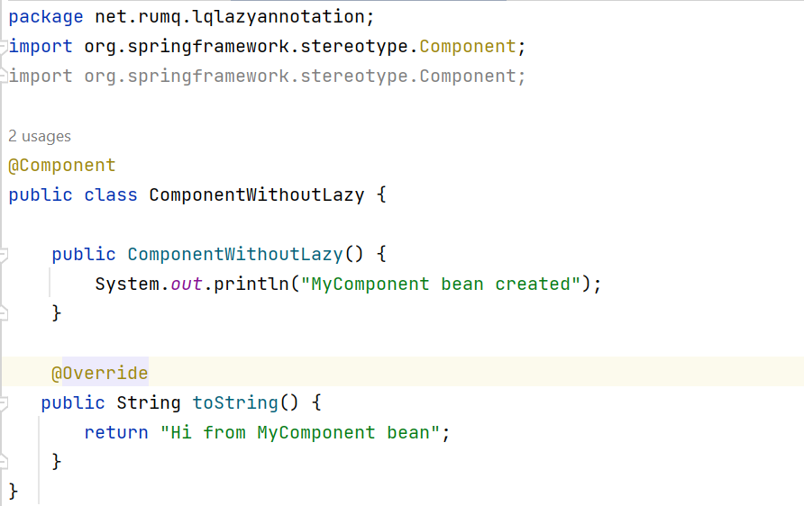
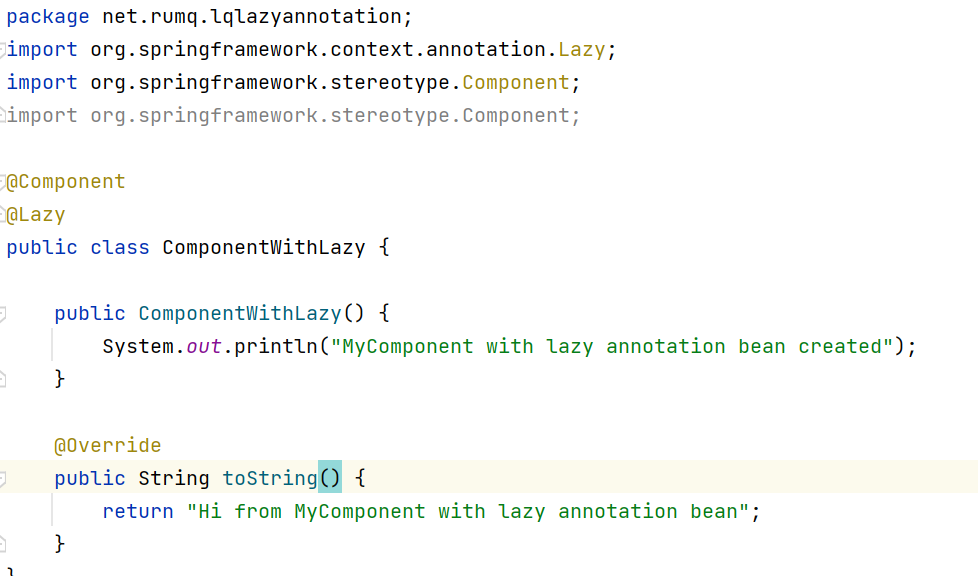
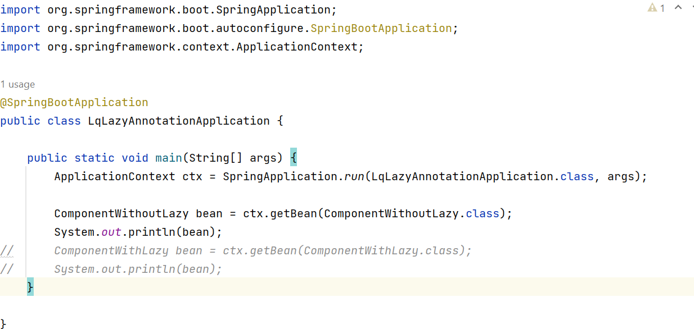
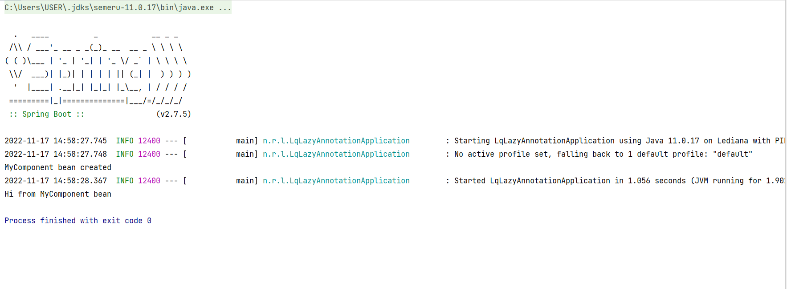
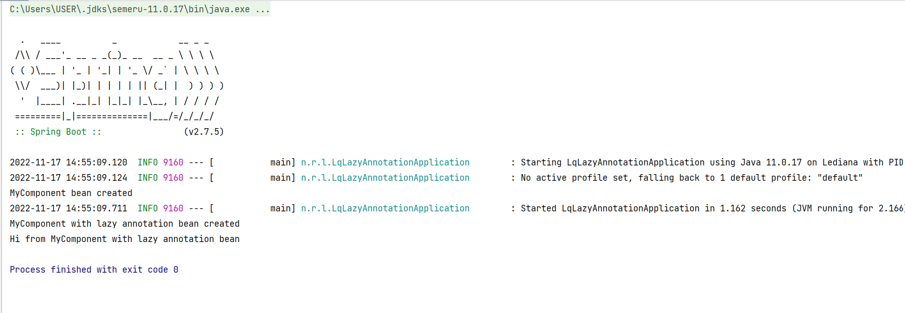

## Assignment #2:
 Create two separate component. One without lazy annotation and one with lazy annotation and see the difference in output.
 ___

*Step I:* First we create a component class called `ComponentWithoutLazy`.
 
  

 *Step II:* Create another class component with lazy annotation called `ComponentWithLazy`

 

*Step III:* Create a main class called `LqLazyAnnotationApplication` to call two another classes and then run to see the difference.

**Output I:** Output of the `ComponentWithoutLazy` class:

**Output II:** Output of the `ComponentWithLazy` class:

**The difference:**
- By default, the program creates and initializates the singleton beans at time of application start up, this happens when we run the class without `@lazy` annotation.
- This pre-initialization of singleton beans is prevented by using `@lazy` annotation.