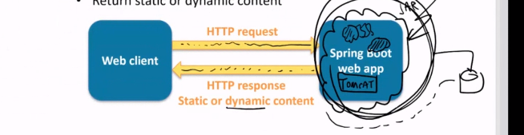

>[Home](../README.md)

# Common class notes by attendees

## 2 Nov 22, Wednesday 

Today's notes taken by : Ilda
Next day's notes will be taken by : ?


**Chapter 1**

Setting IntelliJ IDEA Ultimate edition because the community edition does not support spring boot 
We can use free trial for that which is for 30 days

Most of the companies are using IntelliJ, Eclipse is also a good option to use too.

To create a new project for spring boot there is also a website Spring initializr  https://start.spring.io/

You can choose 
Project : Maven
Language: Java
Spring boot: 2.7.5 
Project Metadata : Fill in the fields.


**Chapter 2**

Create a simple app using IntelliJ
Yellow -java code
Blue- configurations

IntelliJ Java dependencies that we should have installed 
- JDK (e.g. JDK 11)
- Set JAVA_HOME to the JDK folder
- PATH to include the JDK binary folder


Create a new project 
- Enter a suitable name
- Location 
- Language: Java
- Type: Maven
- Group id : the name of the company
- artifact id: is the name of the jar file
- Package name
- Project SDK: is the JDK version (version 11)
- Always choose the jar option - so it can be a complete a stand alone project


In intelliJ there is a Spring Initializr that we can use to create our project.

Aplication Structure
Maven project with a pom.xml file with the information of your project.


Exercise - create the basic spring app using the spring initilizer website
See if you are able to run it using maven.

## 3 Nov 22, Thursday

Today's notes taken by : Stelina
Next day's notes will be taken by : ?

1. **The application structure (continuation of yesterday's notes)**
   - We can find a test Spring Boot class under the test folder that is called Application in the video class. Inside there we can see an anotation @SpringBootApplication which is equivalent to three separate annotation (@Configuration, @EnableAutoConfiguration, @ComponentScan). 

2. **Run the application**
   - Open the terminal on IntelliJ and there type: mvn spring-boot:run. If you don't have maven installen in your machine then you can type: mvnw spring-boot:run . When we run the application a lot of configurations happen and that's why it takes a lot of time for the Spring Boot applications to start. Another way to run the application is to click with the left side of your mouse and pick the "Run" option. 

3. **How to create a web application (demo 3 on GitHub)**
   - Most Spring Boot applications are web applications. 
  
   - Create a new Spring Boot application on IntelliJ and make sure to add the Spring Web dependency on the Dependencies section.

4. **The structure of the Web Application**

The video stopped at minute 73.


## 4 Nov 22, Thursday
Today's notes taken by : LedianaNext day's notes will be taken by : ?


## 7 Nov 22, Monday
 
Notes taken by: Ada
 
### Creating a Spring Boot Web App
 
When it is created as an Web app it has an embedded server such as Tom Cat and it usually run on port 8080
Listen for HTTP requests from a web client (browser)and it returns static or dynamic content.
 
**Create the Spring Boot Web App project:**
1.Open IntellIJ or you can created through start.spring.io
2. Click "New Project"
3. Go to Spring Initializr on the left side of the window and give your project a name
4. Choose your location and the group name, package name
5. Select java version 11 and packing **jar**
6. Click Next
7. Choose dependency and click Web, select Spring Web dependency. Finish
 
 
The generated project is a regular Maven project they have the pom file, where the dependencies are listed
 
The video stopped at minute 89. Slide number 8 on the Web App
 
## 08 Nov 22, Tuesday
 
Notes taken by: Ada
 
Introduction to Spring Boot class for new joiners
Here is the link https://github.com/andyolsen/spring-boot-in-3-weeks with the class slides and codes
 
Explaining web dependencies in pom.xml that are needed for this web app such as spring.framework.web
 
In the static folder (src/main/resources/static) there's were you put your statics values or html code
 
On the static folder create an index.html file
 
```java
<!DOCTYPE html>
<html lang="en">
<head>
   <meta charset="UTF-8">
   <title>Home</title>
</head>
<body>
   Hello world!
</body>
</html>
```
 
Go to the main page inside java folder and add
 
```
System.out.println("**** BEFORE run() ****");
SpringApplication.run(Demo03WebAppApplication.class, args);
System.out.println(***** AFTER run()****)
```
If you run the application it will run in port 8080 and the TomCat server embedded and the index file
Go to browser and http://localhost:8080/index.html to see your application and you will see the message the content from index.html
Spring Boot has auto configuration so when you run it looks in your class path and it creates a tomcat object for you so it is automatically creating a web server and running it for you.
 
### Application properties
 
It is the folder where you initialise your properties. (src/main/resources/application.properties)
 
server.port=8081   // now the application (TomCat) will run in port 8081
 
So now it will look like this http://localhost:8081/index.html in your browser
You only have to change the properties only if you want something else, because it has defaults that work properly
 
Spring Boot it bootstraps your development
 
 
We finished chap 03, tomorrow we will start chap 04_Beans_Dependency
 
 ## 09 Nov 22, Wednesday
 
Notes taken by: Ada

### Beans and Dependency Injections

_Download the repository from GitHub https://github.com/andyolsen/spring-boot-in-3-weeks and open demo-04-beans-dependency-injections on IntellIJ_ 

* A component is a class that spring boot will automatically create a new instance . 
* _Annotations_ 
   - @component
   - @service
   - @repository
   - @controller/@restcontroller

* A bean is an instance, an object
* A depency injection is when one bean is automatically hooked up with another bean

**Why we use dependency injection?**
- Spring boot creates the objects in your project and to point to these objects we use depency inj
  - @autowired -- automatically links objects

Demo package: demo.beans

_We left at minutes 99_

 
## 10 Nov 22, Thursday
 
Notes taken by: Ada
 
Download the git repository https://github.com/andyolsen/spring-boot-in-3-weeks (_Here_ [java-corejava-2210/members/stelina.pema.2210/pages/clone-git-project.md] _you can find how to clone a git repo_)
 
**Demo 02**
1.Open demo-02-simple-app file from the repository that you downloaded
1. Go to main/java/com/demo02SimpleAppApplication  and run the project
 
**Demo 03**
1.Open demo-03-simple-app file from the repository that you downloaded
2. Go to main/java/com/demo03WebAppApplication and run the project
3. Check the terminal for the port that the web app is running
4. If you want to change what is printed on the main page go to index.html and edit the body
 
 
**Demo 04**
1.Open demo-04-beans-dependencyinjection from the repo that you download previously
2. Go to src/main/java/demo/beans/Application and run the file (it will not start the TomCat because it didn't have web-starter dependency)
 
 
Create a new java class and name it MyComponent2 in the same folder as MyComponent.java. Copy the classes inside MyComponent and run the application. Without the annotation it will not change anything if it is runned.
 
 
Constructors have the name of the class for example (MyComponent.java):
```
@Component
public class MyComponent {
 
   public MyComponent() {
       System.out.println("MyComponent bean created");
   }
```
 
 
 
### What is TomCat?
 
Tomcat is a Java HTTP web server environment in which Java code can also run. The default port is 8080, but you can change the default port on resources/application.properties
 
### What is the difference between Simple App application vs Web Application
 
On the Web app we have an extra folder inside the resources folder named static that is created by the spring web dependency, that is also another difference between the two projects.
On the pom.xml you can compare the dependency between two projects, so on the web app we have spring-boot-starter-web dependency.
 
**Exercise:** Make changes on the project and see the results
 


>[Home](../README.md)

